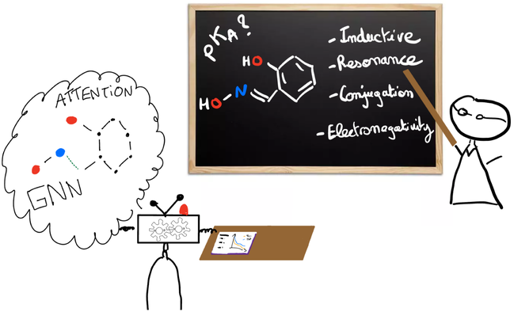

# pKa-predictor
Leveraging our Teaching Experience to Improve Machine Learning: Application to pKa Prediction.
Jérôme Genzling, Ziling Luo, Benjamin Weiser, Nicolas Moitessier
nicolas.moitessier@mcgill.ca
2023-12-07 - revised 2024-06-18

# Required libraries:
torch, torch_geometric, pandas, numpy, rdkit, seaborn, hyperopt

# Repository Structure

- The complete assembled and clean data set can be found in the Datasets folder.
- The clustered and randomly split sets (obtained with the split_train_test_by_TC.py) can be found in the Datasets folder.
- The code to generate the various fingerprints used for the Baseline Models can be found in Baseline_Models/Descriptors.
- These latter will then be used in the respective folders for the traditional models (Baseline_Models/RF or Baseline_Models/XGB).
- All the code related to our GNN/GAT model can be found in the GNN folder.
- All the code used to retrain MolGpKa (code and pickled datasets) can be found in the MolGpKa_retrained.

# Getting started with our GNN model
Command to see the usage of this python script:
python main.py --mode usage

Running any of the mode will first output all the keyword and their default values.

To run the provided model on the csv file called train_set_0.65.csv:

Run the following command (on Windows, for Linux or Mac, you may need it to adapt the format of the path):

python main.py --mode test --n_graph_layers 4 --data_path ..\Datasets\ --input train_set_0.65.csv --model_dir ..\Model\  --output testing_model_train_set_0.65 --model_name model_4-4.pth --infer_pickled ..\Datasets\pickled_data\infer_pickled.pkl --carbons_included False > testing_model_train_set_0.65.out 
